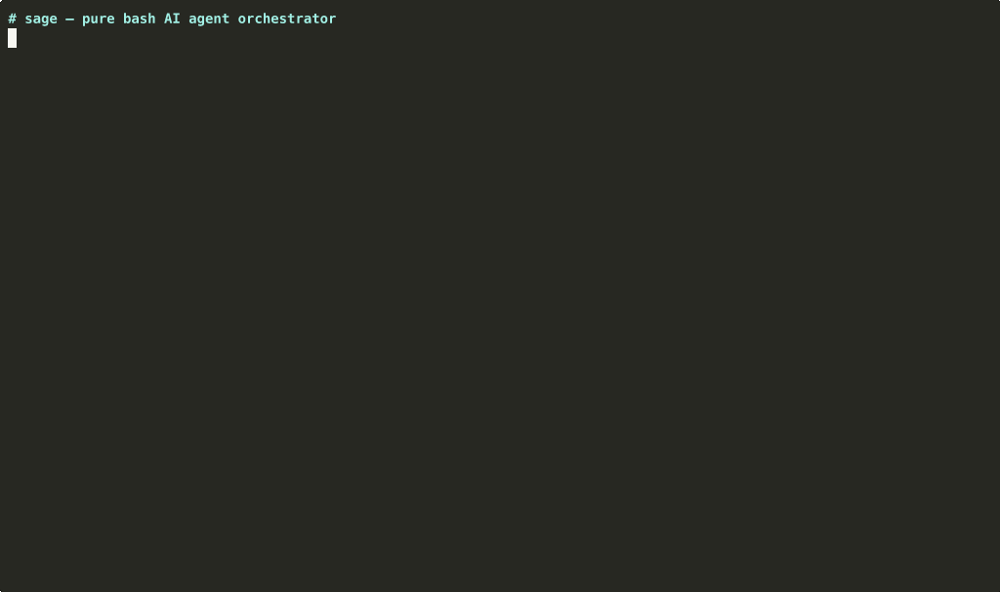
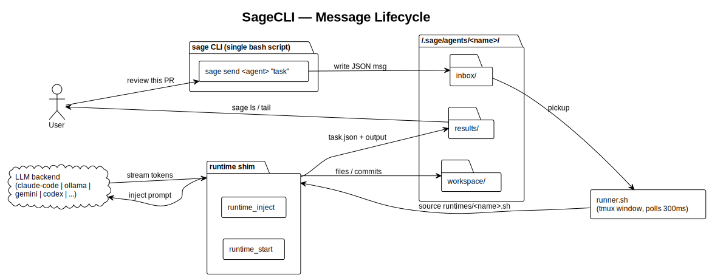

<p align="center">
  
</p>

<p align="center">
  
  
  
  
  <br>
  
  
  
  
  
  
  
  
</p>

<h1 align="center">⚡ sage</h1>
<h3 align="center">The Unix-native control plane for agent CLIs</h3>

<p align="center">
  <strong>You already have Claude Code, Codex, and Gemini CLI.</strong><br>
  Sage lets them work together — or swap between them — without writing Python.<br>
  One bash script. No framework. No lock-in.
</p>

<p align="center">
  <a href="#quick-start">Quick Start</a> •
  <a href="#why-sage">Why sage</a> •
  <a href="#the-moat-in-action">Moat demos</a> •
  <a href="docs/USAGE.md">Usage</a> •
  <a href="docs/COMMANDS.md">Commands</a>
</p>

<p align="center">
  
</p>

---

## Why sage

Every competing orchestrator — claude-flow, ruflo, mux, emdash — optimizes for a single vendor. If Claude Code changes a flag or disappears, your workflows break. Sage is the vendor-neutral layer.

**Three moats, in priority order:**

1. **Neutrality** — 8 runtimes (Claude Code, Codex, Gemini CLI, Cline, Kiro, Ollama, llama.cpp, Bash) + any ACP agent. Same command surface. Swap backends with one flag.
2. **Zero-dependency** — one bash script. `curl | bash` and it works. No venv, no nvm, no node_modules. Ships in CI, airgapped boxes, ephemeral containers.
3. **Unix-native** — JSON out, stdin in, everything pipes. Behaves like `git` / `kubectl` / `jq`, not like a chat UI.

**Agents are processes. Messages are files. The terminal is your IDE.**

| Metric | Value |
|---|---|
| Lines of code | ~8,500 (single bash script) |
| Dependencies | 3 (`bash`, `jq`, `tmux`) |
| Runtimes | 8 + any ACP agent |
| Commands | 53 |
| Tests | 928 (bats-core, CI on ubuntu + macOS) |
| Install time | < 10 seconds |

Sage is **not** a coding assistant and does not compete with Claude Code / Aider / Cline on code quality. It's the glue that lets you use them together. See [docs/POSITIONING.md](docs/POSITIONING.md) for the decision rubric.

---

## Install

```bash
# Homebrew (macOS + Linux)
brew tap youwangd/sage && brew install sage

# curl one-liner
curl -fsSL https://raw.githubusercontent.com/youwangd/SageCLI/main/install.sh | bash

# Manual
git clone https://github.com/youwangd/SageCLI.git
cd SageCLI && ln -s $(pwd)/sage ~/bin/sage && sage init
```

**Requires**: `bash` 4.0+, `jq` 1.6+, `tmux` 3.0+ · **Optional runtimes**: [Claude Code](https://docs.anthropic.com/en/docs/claude-code) · [Gemini CLI](https://github.com/google-gemini/gemini-cli) · [Codex](https://github.com/openai/codex) · [Cline](https://github.com/cline/cline) · any [ACP agent](https://agentclientprotocol.com/get-started/agents).

---

## Quick Start

```bash
sage create worker --runtime claude-code
sage send worker "Build a Python CLI that converts CSV to JSON"

sage peek worker          # live tool calls
sage tasks worker         # task status
sage result <task-id>     # structured output
```

`sage start` is optional — `send` and `call` auto-start agents. Messages can be inline or `@file`:

```bash
sage send worker "Quick task"
sage send worker @prompt.md
sage send worker @~/tasks/big-project.md
```

See [docs/USAGE.md](docs/USAGE.md) for the 10 core workflows: parallel multi-runtime audit, headless CI, MCP/skills, guardrails, task templates, plan orchestrator, live monitoring, tracing.

---

## The moat in action

Three things sage does that nobody else in this space does today. Each links to a full narrative.

### 🛡️ Vendor kill-switch

Primary AI vendor goes down? Workflow auto-routes to the next healthy runtime. One flag. No config change.

<p align="center">
  
</p>

```bash
sage send reviewer-primary "Review src/main.py" \
  --fallback reviewer-gemini \
  --fallback reviewer-local
# ⚠  primary 'reviewer-primary' runtime unreachable → failing over to 'reviewer-local'
# ✓  task t-1776985392-26333 → reviewer-local
```

Pre-flight health check — if the primary's binary is unreachable or the daemon isn't responding, sage tries each fallback in order. Every competitor (claude-flow, ruflo, mux, emdash) is single-vendor-locked. Full narrative + drill: [docs/use-case-kill-switch.md](docs/use-case-kill-switch.md).

### 📊 Bench-as-code

Should you buy Claude Code seats, Gemini subscriptions, or run a local model? Run your actual tasks through each vendor's actual agent CLI:

```bash
sage bench run ./bench-tasks --agents claude-agent,gemini-agent,ollama-agent
sage bench report --format markdown
```

Real dogfood on this repo (5 tasks × 3 agents, CPU-only box, 2026-04-24):

| Agent | Success rate | Median wall |
|---|---|---|
| bench-claude (Claude Code) | 60 % | 46,268 ms |
| bench-ollama (llama3.2:3b) | 100 % | 2,577 ms |
| bench-echo (null baseline) | 0 % | 2,057 ms |

For trivial orchestration tasks, a small local model on CPU beats a full coding agent CLI — the coding agent's scaffolding cost dominates wall-time for short prompts. Full analysis + honest caveats: [docs/use-case-bench.md](docs/use-case-bench.md).

### 🖥️ Local model, zero cloud

Three `ollama` agents running `llama3.2:3b` in parallel on a **16-core Xeon, 62 GB RAM, no GPU**:

| Metric | Value |
|---|---|
| 3 parallel `sage send` round-trip | **34 s** end-to-end |
| Raw ollama throughput | 13.81 tok/s gen · 23.67 tok/s prompt eval |
| Peak CPU / RAM | 75 % · ~2.4 GB resident |

Set `OLLAMA_NUM_PARALLEL=3` for real inference parallelism. See the [r/LocalLLaMA write-up](https://www.reddit.com/r/LocalLLaMA/comments/1stvezm/).

---

## Runtimes

| Runtime | Backend | Streaming |
|---|---|---|
| `claude-code` | [Claude Code CLI](https://docs.anthropic.com/en/docs/claude-code) | ✅ stream-json |
| `gemini-cli` | [Gemini CLI](https://github.com/google-gemini/gemini-cli) | ✅ json |
| `codex` | [Codex CLI](https://github.com/openai/codex) | — |
| `cline` | [Cline CLI](https://github.com/cline/cline) | ✅ json |
| `kiro` | [Kiro](https://kiro.dev) | ✅ json |
| `ollama` | [Ollama](https://ollama.com) | ✅ tokens |
| `llama-cpp` | [llama.cpp](https://github.com/ggerganov/llama.cpp) | ✅ tokens |
| `acp` | [Agent Client Protocol](https://agentclientprotocol.com) | ✅ JSON-RPC |
| `bash` | Shell script | — |

The `acp` runtime speaks JSON-RPC 2.0 over stdio and maintains persistent sessions — unlike the dedicated runtimes (one-shot per task), ACP enables true live steering. Adding a runtime is one file with two functions. See [DEVELOPMENT.md](DEVELOPMENT.md).

---

## Architecture

<p align="center">
  
</p>

```
sage CLI
  │
  ├─ sage create <name>    → ~/.sage/agents/<name>/{inbox,workspace,results}
  ├─ sage send <name> msg  → writes JSON to inbox/, auto-starts if needed
  │
  └─ runner.sh (per agent, in tmux window)
       ├─ polls inbox/ every 300ms
       ├─ sources runtimes/<runtime>.sh
       ├─ calls runtime_inject() per message
       ├─ streams events to tmux pane
       └─ writes task status + results mechanically
```

Everything is a file in `~/.sage/`: inbox/workspace/results/steer.md per agent, plus runtimes/, tools/, tasks/, plans/, trace.jsonl.

---

## Commands

53 commands in 12 domains. Full reference: [docs/COMMANDS.md](docs/COMMANDS.md). Inline: `sage help` or `sage <command> --help`.

Highlights: `create`, `send`, `call`, `tasks`, `plan`, `bench`, `task`, `mcp`, `skill`, `memory`, `trace`, `dashboard`, `doctor`.

---

## Contributing

```bash
wc -l sage            # ~8,500 lines, one file
bats tests/           # 928 tests, 155 files
./sage init --force   # run from source
./sage create test --runtime bash
```

See [DEVELOPMENT.md](DEVELOPMENT.md) for architecture, runtime interface, and how to add new runtimes.

---

## Roadmap

v1.0 → v1.4.0 shipped. Phases 0–21 complete: testing foundation, git worktrees, headless/CI, MCP + skills, inter-agent messaging, shared context, export/import, observability, guardrails, per-agent env, 8 runtimes, completions, swarm patterns, TUI dashboard, persistent sessions, token/cost tracking, file watcher, ACP Registry, vendor kill-switch, bench-as-code.

**Remaining work is adoption, not features.**

| Track | Status |
|---|---|
| [awesome-cli-coding-agents](https://github.com/bradAGI/awesome-cli-coding-agents) listing | ✅ merged (PR #47) |
| Demo GIF + kill-switch GIF | ✅ |
| `sage acp ls/show/install` | ✅ |
| r/LocalLLaMA post | ✅ [1stvezm](https://www.reddit.com/r/LocalLLaMA/comments/1stvezm/) |
| HN Show launch post | 🚧 |
| Tembo "AI Coding Agents Compared" submission | 🚧 |

Full competitive intel, weekly monitoring, detailed specs: [ROADMAP.md](ROADMAP.md).

---

## License

MIT — see [LICENSE](LICENSE).

---

<p align="center">
  <strong>⚡ sage</strong> — Because the best agent framework is the one you can read in an afternoon.
</p>
