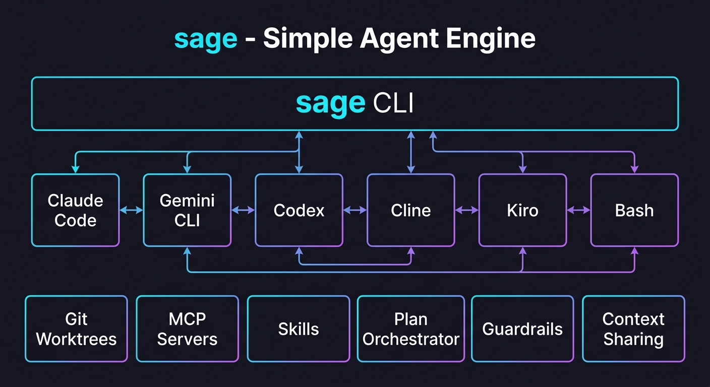

<p align="center">
  
</p>

<p align="center">
  
  
  
  
  <br>
  
  
  
  
  
  
</p>

<h1 align="center">⚡ sage</h1>
<h3 align="center">Simple Agent Engine</h3>

<p align="center">
  <strong>Orchestrate AI coding agents from your terminal.</strong><br>
  No frameworks. No npm. No Python. Just bash, jq, and tmux.
</p>

<p align="center">
  <a href="#quick-start">Quick Start</a> •
  <a href="#why-sage">Why sage?</a> •
  <a href="#use-cases">Use Cases</a> •
  <a href="#live-monitoring">Live Monitoring</a> •
  <a href="#commands">Commands</a> •
  <a href="DEVELOPMENT.md">Development</a>
</p>

---

## Why sage?

Every AI coding agent framework wants you to learn a new language, install a runtime, and buy into an ecosystem. sage takes a different approach:

**Agents are processes. Messages are files. The terminal is your IDE.**

```bash
sage create reviewer --runtime claude-code
sage create auditor --runtime kiro
sage send --headless --json reviewer "Review src/main.py for bugs"
sage send --headless --json auditor "Security audit src/main.py"
# Both run in parallel. Structured JSON output. Any runtime.
```

### The Numbers

| Metric | Value |
|--------|-------|
| Lines of code | ~5,150 (single bash script) |
| Dependencies | 3 (`bash`, `jq`, `tmux`) |
| Runtimes | 6 (Claude Code, Gemini CLI, Codex, Cline, Kiro, bash) |
| Commands | 42 |
| Tests | 338 (bats-core, CI on ubuntu + macOS) |
| Install time | < 10 seconds |

### Architecture at a Glance

<p align="center">
  
</p>

### What Makes sage Different

Every competitor requires Node.js, Python, Rust, or Go. sage requires bash.

| | sage | claude-flow | gastown | Claude Squad |
|---|---|---|---|---|
| Language | bash | TypeScript | TypeScript | Go |
| Dependencies | jq + tmux | Node.js + npm | Node.js + npm | Go runtime |
| Runtimes | 6 (any agent) | Claude only | Claude only | Claude only |
| Headless/CI | ✅ `--headless --json` | ❌ | ❌ | ❌ |
| Git worktrees | ✅ built-in | ❌ | ✅ | ❌ |
| MCP support | ✅ registry + lifecycle | ✅ | ❌ | ❌ |
| Skills system | ✅ install + registries | ❌ | ❌ | ❌ |

### Design Principles

- **Unix-native** — Agents are tmux windows. Messages are JSON files in directories. No daemons, no databases, no Docker.
- **Runtime-agnostic** — Plug in Claude Code, Gemini CLI, Codex, Cline, Kiro, or any ACP agent. Adding a new runtime is one file with two functions.
- **Mechanical, not behavioral** — Task tracking, parent-child relationships, and tracing are handled by the engine, not by asking LLMs to remember protocols.
- **Observable** — Real-time streaming, `peek` into any agent, `trace` the full call tree. You always know what's happening.
- **Secure by default** — Agent name validation, workspace sandboxing for file I/O, atomic writes to prevent partial reads, and path traversal prevention at every layer.
- **Zero lock-in** — It's a single bash script. Read it, fork it, modify it. Your agents' state is plain files on disk.

---

## Install

**Homebrew** (macOS & Linux):
```bash
brew tap youwangd/sage
brew install sage
```

**npm** (cross-platform):
```bash
npm install -g @youwangd/sage
```

**curl** (one-liner):
```bash
curl -fsSL https://raw.githubusercontent.com/youwangd/SageCLI/main/install.sh | bash
```

**Manual:**
```bash
git clone https://github.com/youwangd/SageCLI.git
cd SageCLI
ln -s $(pwd)/sage ~/bin/sage    # or /usr/local/bin/sage
sage init
```

**Requirements:** `bash` 4.0+, `jq` 1.6+, `tmux` 3.0+

**Optional runtimes:** [Claude Code CLI](https://docs.anthropic.com/en/docs/claude-code), [Gemini CLI](https://github.com/google-gemini/gemini-cli), [Codex CLI](https://github.com/openai/codex), [Cline CLI](https://github.com/cline/cline), or any [ACP-compatible agent](https://agentclientprotocol.com/get-started/agents)

---

## Quick Start

```bash
# Create an agent and give it work
sage create worker --runtime claude-code
sage send worker "Build a Python CLI that converts CSV to JSON"

# Watch it work
sage peek worker          # live tool calls + output
sage attach worker        # full tmux terminal access

# Get the result
sage tasks worker         # task status + elapsed time
sage result <task-id>     # structured output
```

`sage start` is optional — `send` and `call` auto-start agents that aren't running.

Messages can be inline text or loaded from files:

```bash
sage send worker "Quick task"               # inline
sage send worker @prompt.md                 # from file
sage send worker @~/tasks/big-project.md    # ~ expansion supported
```

---

## Use Cases

### 🔥 Parallel Multi-Runtime Security Audit (Verified)

Run different AI agents on the same code simultaneously, each in an isolated git branch:

```bash
# Create two agents with different runtimes, each in their own worktree
sage create reviewer --worktree review-branch --runtime claude-code
sage create auditor --worktree audit-branch --runtime kiro

# Fire both in parallel
sage send --headless --json reviewer "Review cmd_send() for bugs" &
sage send --headless --json auditor "Security audit cmd_send()" &
wait

# Results:
# reviewer (Claude Code, 12s): Found 3 bugs — unsafe ls parsing, missing error handling
# auditor  (Kiro, 41s):        Found 6 issues — path traversal, command injection, unsafe glob
# Wall time: 41s (parallel), not 53s (sequential)
```

### ⚡ Headless CI Mode (Verified)

Run sage in GitHub Actions — no tmux, no terminal, structured JSON output:

```bash
sage send --headless --json reviewer "Is this safe? eval(\$user_input)"
```
```json
{
  "status": "done",
  "task_id": "headless-1775793946",
  "exit_code": 0,
  "elapsed": 34,
  "output": "UNSAFE. eval \"$user_input\" is a critical command injection vulnerability..."
}
```

Use the included GitHub Action:
```yaml
- uses: youwangd/SageCLI@main
  with:
    runtime: claude-code
    task: "Review this PR for security issues"
```

### 🌐 6 Runtimes, One Interface (Verified)

Same command, any AI backend:

```bash
sage create a1 --runtime claude-code   # Anthropic Claude (Bedrock)
sage create a2 --runtime gemini-cli    # Google Gemini
sage create a3 --runtime codex         # OpenAI Codex (via LiteLLM)
sage create a4 --runtime cline         # Cline (configurable)
sage create a5 --runtime kiro          # Kiro (Bedrock)
sage create a6 --runtime bash          # Custom scripts

# All use the same interface:
sage send --headless --json a1 "Review this code"
sage send --headless --json a2 "Review this code"
# ... identical JSON output format regardless of runtime
```

### 🏗️ Plan Orchestrator with Wave Execution

Decompose complex goals into dependency-aware parallel waves:

```bash
sage plan "Build a Python REST API with auth, CRUD, tests, and docs"

#  Wave 1: #1 Define API schema (sequential)
#  Wave 2: #2 Build auth + #3 Build CRUD (parallel)
#  Wave 3: #4 Write tests + #5 Generate docs (parallel)
```

### 🔧 MCP + Skills Ecosystem

```bash
# Register MCP servers
sage mcp add github --command "npx" --args "@modelcontextprotocol/server-github"
sage create dev --runtime claude-code --mcp github

# Install community skills
sage skill install https://github.com/user/code-review-skill
sage create reviewer --runtime claude-code --skill code-review-pro

# Skills inject system prompts + tool configs automatically
sage send reviewer "Review PR #42"
```

### 🛡️ Agent Guardrails

```bash
# Auto-kill after 30 minutes
sage create worker --runtime claude-code --timeout 30m

# Stop after 50 task completions
sage create worker --runtime claude-code --max-turns 50

# Per-agent environment isolation
sage env set worker API_KEY=sk-xxx
sage env set worker DATABASE_URL=postgres://...
```

---

## Task Templates

Predefined task templates with checklists, constraints, and structured output:

```bash
sage task --list
#  review       (auto)  Code review with prioritized findings
#  test         (auto)  Generate comprehensive test suite
#  spec         (auto)  Write technical specification
#  implement    (auto)  Implement a feature from spec
#  refactor     (auto)  Refactor code while preserving behavior
#  document     (auto)  Generate documentation
#  debug        (auto)  Debug and fix a reported issue

# Run a template against files
sage task review src/auth.py src/middleware.py
sage task test src/api/ --message "Focus on edge cases"
sage task refactor src/legacy.py --timeout 180
sage task debug --message "Users report 500 on /login after upgrade"
```

Templates live in `~/.sage/tasks/` as markdown files with YAML frontmatter. Each template specifies:
- Runtime preference (`auto` defaults to ACP)
- Input type (`files`, `description`, or `both`)
- A detailed checklist the agent follows

Run in background with `--background`:
```bash
sage task implement --message "Add JWT refresh tokens" --background
# ✓ task t-123 → sage-task-implement-... (background)
# Track: sage peek sage-task-implement-... | sage result t-123
```

---

## Plan Orchestrator

Decompose complex goals into dependency-aware task waves with automatic parallel execution:

```bash
sage plan "Build a Python REST API with auth, CRUD endpoints, tests, and docs"

#  📋 Plan: Build a Python REST API...
#
#  #1 [spec] Define API schema and auth strategy
#  #2 [implement] Build auth module (depends: #1)
#  #3 [implement] Build CRUD endpoints (depends: #1)
#  #4 [test] Write test suite (depends: #2, #3)
#  #5 [document] Generate API docs (depends: #2, #3)
#
#  Waves:
#    Wave 1: #1
#    Wave 2: #2, #3 (parallel)
#    Wave 3: #4, #5 (parallel)
#
#  [a]pprove  [e]dit  [r]eject
```

The plan orchestrator:
1. Creates a planning agent to decompose your goal
2. Normalizes the output (handles different JSON formats from different LLMs)
3. Computes dependency waves with cycle detection
4. Executes each wave in parallel — agents in the same wave run simultaneously
5. Passes results from completed tasks as context to downstream dependencies

```bash
# Auto-approve (skip interactive prompt)
sage plan "Refactor auth module to use OAuth2" --yes

# Save plan for later
sage plan "Migrate database" --save migration.json

# Run a saved plan
sage plan --run migration.json

# Resume from where it left off (skips completed tasks)
sage plan --resume ~/.sage/plans/plan-1710347041.json

# List saved plans
sage plan --list

# Interactive editing before execution
sage plan "Build a dashboard"
# > edit> drop 3
# > edit> add test "Integration tests for API" --depends 1,2
# > edit> done
```

---

## Live Monitoring

Both CLI runtimes stream events in real-time. Tool calls, text responses, and progress appear as they happen:

```bash
sage peek master --lines 20
```

```
 ⚡ peek: master

 Live output:
   I'll create a professional restaurant template with modern design...

 Runner log:
   [22:15:28] master: invoking claude-code...
   I'll create a professional restaurant template...
     → ToolSearch
     → TodoWrite
     → Write
     → TodoWrite
     → Write

 Workspace: 4 file(s)
   22:17  19889  styles.css
   22:16  23212  index.html
```

`sage attach` drops you into the tmux session for full terminal access.

---

## Task Tracking

Every task gets a trackable ID. Status transitions are mechanical — no LLM behavior dependency.

```
queued → running → done
```

```bash
sage send worker "Build the entire app"
# ✓ task t-1710347041 → worker

sage tasks worker
#  TASK              AGENT   STATUS   ELAPSED  FROM
#  t-1710347041      worker  running  45s      cli

sage result t-1710347041     # structured output when done
sage wait worker             # block until agent finishes
```

---

## Tracing

Full observability into how agents collaborate:

```bash
# Timeline
sage trace
#  17:00:40  send   cli → orch      "Build the app..."
#  17:01:02  send   orch → sub1     "Write fibonacci..."
#  17:01:20  done   sub1 ✓          18s
#  17:02:08  done   orch ✓          88s

# Call hierarchy
sage trace --tree
#  t-123 cli → orch "Build the app" (88s) ✓
#    ├─ t-456 orch → sub1 "Write fibonacci..." (18s) ✓
#    └─ t-789 orch → sub2 "Write factorial..." (16s) ✓

# Filter
sage trace orch              # events for one agent
sage trace --tree -n 50      # last 50 events as tree
```

---

## Runtimes

| Runtime | Backend | Streaming | How it works |
|---|---|---|---|
| `claude-code` | [Claude Code CLI](https://docs.anthropic.com/en/docs/claude-code) | ✅ stream-json | Real-time tool calls + text via `--output-format stream-json` |
| `gemini-cli` | [Gemini CLI](https://github.com/google-gemini/gemini-cli) | ✅ json | Headless mode via `-p`, supports `--yolo` for auto-approve |
| `codex` | [Codex CLI](https://github.com/openai/codex) | — | Exec mode with auto-approve |
| `cline` | [Cline CLI](https://github.com/cline/cline) | ✅ json | Real-time events via `--json` |
| `acp` | [Agent Client Protocol](https://agentclientprotocol.com) | ✅ JSON-RPC | Universal bridge — any ACP agent via stdio. Persistent sessions with live steering. |
| `bash` | Shell script | — | Custom `handler.sh` processes messages |

The `acp` runtime speaks JSON-RPC 2.0 over stdio and works with **any** ACP-compatible agent:

```bash
sage create worker --agent cline         # Cline via ACP
sage create worker --agent claude-code   # Claude Code via ACP (needs claude-agent-acp adapter)
sage create worker --agent goose         # Goose via ACP
sage create worker --agent kiro          # Kiro via ACP
sage create worker --agent gemini        # Gemini CLI via ACP
```

Unlike the dedicated `cline`/`claude-code` runtimes (one-shot per task), ACP maintains a **persistent session** — follow-up messages go into the same conversation, enabling true live steering.

Adding a runtime is one file with two functions (`runtime_start` + `runtime_inject`). See [DEVELOPMENT.md](DEVELOPMENT.md).

---

## Architecture

```
sage CLI
  │
  ├─ sage create <name>    → ~/.sage/agents/<name>/{inbox,workspace,results}
  ├─ sage send <name> msg  → writes JSON to inbox/, auto-starts if needed
  │
  └─ runner.sh (per agent, in tmux window)
       ├─ polls inbox/ every 300ms
       ├─ sources runtimes/<runtime>.sh
       ├─ calls runtime_inject() per message
       ├─ streams events to tmux pane (live monitoring)
       └─ writes task status + results mechanically
```

**Everything is a file:**

```
~/.sage/
├── agents/<name>/
│   ├── inbox/          # incoming messages
│   ├── workspace/      # agent's working directory
│   ├── results/        # task status + output
│   ├── steer.md        # steering context
│   └── .live_output    # current task's live output
├── runtimes/           # claude-code, gemini-cli, codex, cline, acp, bash
├── tools/              # shared utilities
├── tasks/              # task templates (review, test, spec, ...)
├── plans/              # saved execution plans
├── trace.jsonl         # append-only event log
└── runner.sh           # agent process loop
```

---

## Commands

```
AGENTS
  init [--force]                     Initialize ~/.sage/
  demo                               Scaffold a 3-agent fan-out demo
  create <name> [--runtime R]        Create agent (claude-code|gemini-cli|codex|cline|acp|bash)
  start [name|--all]                 Start in tmux
  stop [name|--all]                  Stop (kills process group)
  restart [name|--all]               Restart
  status                             Tree view of all agents
  ls                                 List agent names
  rm <name>                          Remove agent
  clean                              Clean stale files

MESSAGING & TASKS
  send <to> <message|@file>          Fire-and-forget (returns task ID)
    [--force]                        Cancel running task first
  call <to> <message|@file> [t]      Sync request/response (default 60s)
  tasks [name]                       List tasks with status
  result <task-id>                   Get task result
  wait <name> [--timeout N]          Wait for agent to finish
  peek <name> [--lines N]            Live output + workspace
  steer <name> <msg> [--restart]     Course-correct agent
  inbox [--json] [--clear]           View/clear CLI messages

TASK TEMPLATES
  task --list                        Show available templates
  task <template> [files...]         Execute a task template
    [--message "..."]                Additional context
    [--runtime <rt>]                 Override template runtime
    [--timeout <sec>]                Timeout (default: 300s)
    [--background]                   Run async, return task ID

PLAN ORCHESTRATOR
  plan <goal>                        Decompose goal into task waves
    [--save <file>]                  Save plan to file
    [--yes]                          Auto-approve (skip interactive)
  plan --run <file>                  Execute a saved plan
  plan --resume <file>               Resume from failure point
  plan --list                        Show saved plans

DEBUG & OBSERVABILITY
  logs <name> [-f|--clear]           View/tail/clear logs
  trace [name] [--tree] [-n N]       Agent interaction trace
  attach [name]                      Attach to tmux session

TOOLS
  tool add <name> <path>             Register a tool
  tool ls                            List tools
```

---

## Configuration

Agents are configured via `runtime.json`:

```json
{
  "runtime": "claude-code",
  "model": "claude-sonnet-4-6",
  "parent": "orch",
  "workdir": "/path/to/project",
  "created": "2026-03-13T22:00:00Z"
}
```

Customize agent behavior by editing `instructions.md` in the agent directory.

---

## Contributing

sage is a single bash script. Read it, understand it, improve it.

```bash
wc -l sage    # ~5000 lines

# Run tests
bats tests/   # 338 tests across 12 files

# Run from source
./sage init --force
./sage create test --runtime bash
```

See [DEVELOPMENT.md](DEVELOPMENT.md) for architecture details, runtime interface, and how to add new runtimes.

---

## Roadmap

Phases 0–11 shipped (v1.0 → v1.3.0): testing foundation, git worktree isolation, headless/CI mode, MCP integration, skills system, context sharing, agent export/import, observability, guardrails, per-agent env, aggregate stats, and 6 runtimes.

What's next:

| Phase | What | Why |
|-------|------|-----|
| 12 | Shell completions | Tab-complete commands and agent names (in progress) |
| 13 | Adoption & visibility | Demo GIF, HN launch, awesome-list merge |
| 14 | Swarm patterns | `--pattern fan-out/pipeline/debate/map-reduce` |
| 15 | TUI dashboard | Live agent status, log tailing, plan progress |
| 16 | Persistent sessions | Survive reboots, resume plans |
| 17 | Local model support | `--runtime ollama` / `--runtime llama-cpp` |
| 18 | Cost tracking | Token counting, `stats --cost`, `stats --efficiency` |

See [ROADMAP.md](ROADMAP.md) for competitive analysis and detailed specs.

---

## License

MIT — see [LICENSE](LICENSE).

---

<p align="center">
  <strong>⚡ sage</strong> — Because the best agent framework is the one you can read in an afternoon.
</p>
CENSE](LICENSE).

---

<p align="center">
  <strong>⚡ sage</strong> — Because the best agent framework is the one you can read in an afternoon.
</p>
