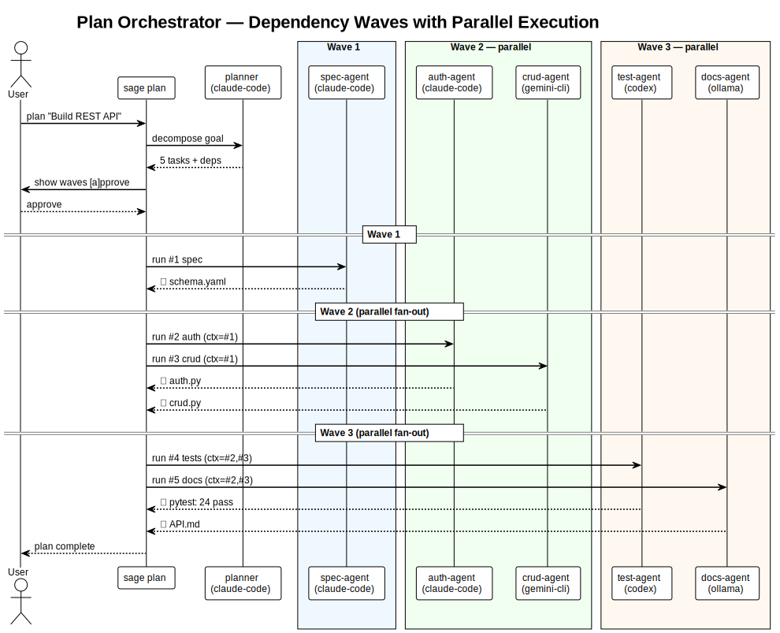

# Usage Guide

Hands-on walkthroughs for sage's core workflows. For command-by-command reference see [COMMANDS.md](COMMANDS.md); for moat-demonstration stories see [use-case-kill-switch.md](use-case-kill-switch.md) and [use-case-bench.md](use-case-bench.md).

## Table of contents

- [Parallel multi-runtime security audit](#parallel-multi-runtime-security-audit)
- [Headless CI mode](#headless-ci-mode)
- [8 runtimes, one interface](#8-runtimes-one-interface)
- [MCP + skills ecosystem](#mcp--skills-ecosystem)
- [Agent guardrails](#agent-guardrails)
- [Task templates](#task-templates)
- [Plan orchestrator](#plan-orchestrator)
- [Live monitoring](#live-monitoring)
- [Task tracking](#task-tracking)
- [Tracing](#tracing)

---

## Parallel multi-runtime security audit

Run different AI agents on the same code simultaneously, each in an isolated git branch:

```bash
sage create reviewer --worktree review-branch --runtime claude-code
sage create auditor  --worktree audit-branch  --runtime kiro

sage send --headless --json reviewer "Review cmd_send() for bugs" &
sage send --headless --json auditor  "Security audit cmd_send()" &
wait

# reviewer (Claude Code, 12s): 3 bugs — unsafe ls parsing, missing error handling
# auditor  (Kiro, 41s):        6 issues — path traversal, command injection, unsafe glob
# Wall time: 41s (parallel), not 53s (sequential)
```

## Headless CI mode

No tmux, no terminal, structured JSON out:

```bash
sage send --headless --json reviewer "Is this safe? eval(\$user_input)"
```
```json
{
  "status": "done",
  "task_id": "headless-1775793946",
  "exit_code": 0,
  "elapsed": 34,
  "output": "UNSAFE. eval \"$user_input\" is a critical command injection vulnerability..."
}
```

GitHub Action:
```yaml
- uses: youwangd/SageCLI@main
  with:
    runtime: claude-code
    task: "Review this PR for security issues"
```

## 8 runtimes, one interface

```bash
sage create a1 --runtime claude-code   # Anthropic Claude (Bedrock)
sage create a2 --runtime gemini-cli    # Google Gemini
sage create a3 --runtime codex         # OpenAI Codex
sage create a4 --runtime cline         # Cline
sage create a5 --runtime kiro          # Kiro (Bedrock)
sage create a6 --runtime ollama --model llama3.2:3b   # local
sage create a7 --runtime llama-cpp                     # local GGUF
sage create a8 --runtime bash          # custom shell handler

# Identical JSON output regardless of runtime:
sage send --headless --json a1 "Review this code"
sage send --headless --json a6 "Review this code"
```

## MCP + skills ecosystem

```bash
sage mcp add github --command "npx" --args "@modelcontextprotocol/server-github"
sage create dev --runtime claude-code --mcp github

sage skill install https://github.com/user/code-review-skill
sage create reviewer --runtime claude-code --skill code-review-pro

sage send reviewer "Review PR #42"
```

## Agent guardrails

```bash
sage create worker --runtime claude-code --timeout 30m       # auto-kill after 30m
sage create worker --runtime claude-code --max-turns 50      # stop after 50 tasks

sage env set worker API_KEY=sk-xxx
sage env set worker DATABASE_URL=postgres://...
```

## Task templates

Predefined templates with checklists and structured output:

```bash
sage task --list
#  review       (auto)  Code review with prioritized findings
#  test         (auto)  Generate comprehensive test suite
#  spec         (auto)  Write technical specification
#  implement    (auto)  Implement a feature from spec
#  refactor     (auto)  Refactor code while preserving behavior
#  document     (auto)  Generate documentation
#  debug        (auto)  Debug and fix a reported issue

sage task review src/auth.py src/middleware.py
sage task test src/api/ --message "Focus on edge cases"
sage task refactor src/legacy.py --timeout 180
sage task debug --message "Users report 500 on /login after upgrade"
```

Templates live in `~/.sage/tasks/` as markdown files with YAML frontmatter (runtime preference, input type, checklist).

Background mode:
```bash
sage task implement --message "Add JWT refresh tokens" --background
# ✓ task t-123 → sage-task-implement-... (background)
```

## Plan orchestrator

<p align="center">
  
</p>

Decompose complex goals into dependency-aware task waves with automatic parallel execution:

```bash
sage plan "Build a Python REST API with auth, CRUD endpoints, tests, and docs"

#  📋 Plan: Build a Python REST API...
#
#  #1 [spec] Define API schema and auth strategy
#  #2 [implement] Build auth module (depends: #1)
#  #3 [implement] Build CRUD endpoints (depends: #1)
#  #4 [test] Write test suite (depends: #2, #3)
#  #5 [document] Generate API docs (depends: #2, #3)
#
#  Waves:
#    Wave 1: #1
#    Wave 2: #2, #3 (parallel)
#    Wave 3: #4, #5 (parallel)
#
#  [a]pprove  [e]dit  [r]eject
```

How it works:
1. Planning agent decomposes the goal
2. Output normalized across LLM JSON formats
3. Dependency waves computed with cycle detection
4. Each wave executes in parallel
5. Results from completed tasks flow as context to downstream

```bash
sage plan "Refactor auth to OAuth2" --yes              # skip interactive prompt
sage plan "Migrate database" --save migration.json     # save for later
sage plan --run migration.json                         # run a saved plan
sage plan --resume ~/.sage/plans/plan-1710347041.json  # skip completed
sage plan --list                                       # saved plans
sage plan --pattern fan-out "Audit repo"               # swarm pattern
```

## Live monitoring

```bash
sage peek master --lines 20
```

```
 ⚡ peek: master

 Live output:
   I'll create a professional restaurant template with modern design...

 Runner log:
   [22:15:28] master: invoking claude-code...
     → ToolSearch
     → TodoWrite
     → Write

 Workspace: 4 file(s)
   22:17  19889  styles.css
   22:16  23212  index.html
```

`sage attach` drops you into the tmux session directly. `sage dashboard` gives a live TUI across all agents.

## Task tracking

Every task has a trackable ID. State transitions are mechanical, not LLM-driven:

```
queued → running → done
```

```bash
sage send worker "Build the entire app"
# ✓ task t-1710347041 → worker

sage tasks worker
#  TASK              AGENT   STATUS   ELAPSED  FROM
#  t-1710347041      worker  running  45s      cli

sage result t-1710347041
sage wait worker
```

## Tracing

```bash
# Timeline
sage trace
#  17:00:40  send   cli → orch      "Build the app..."
#  17:01:02  send   orch → sub1     "Write fibonacci..."
#  17:01:20  done   sub1 ✓          18s
#  17:02:08  done   orch ✓          88s

# Call hierarchy
sage trace --tree
#  t-123 cli → orch "Build the app" (88s) ✓
#    ├─ t-456 orch → sub1 "Write fibonacci..." (18s) ✓
#    └─ t-789 orch → sub2 "Write factorial..." (16s) ✓

sage trace orch              # filter to one agent
sage trace --tree -n 50      # last 50 events as tree
```
